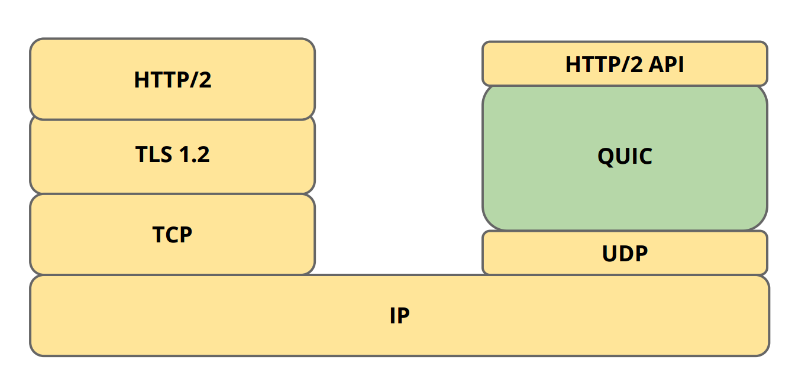
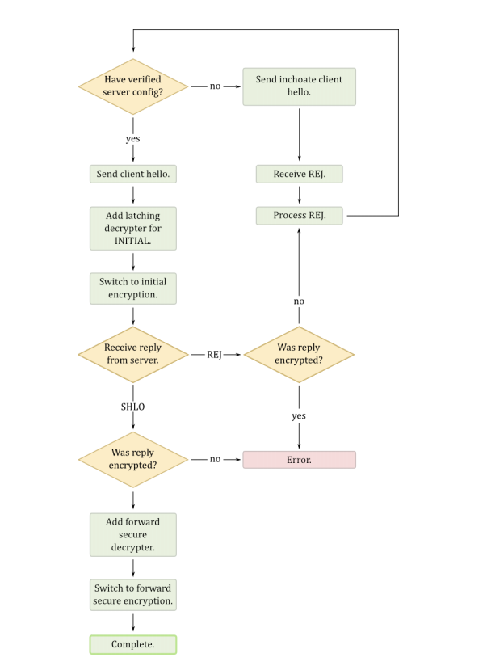
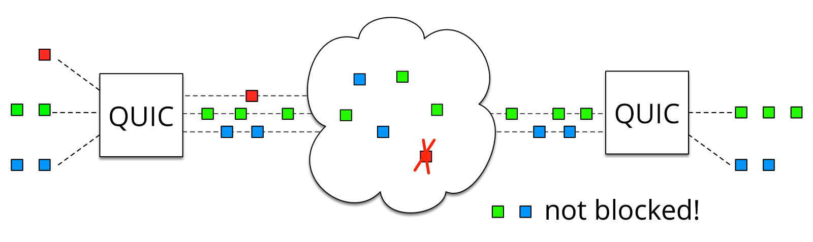

# <center>quic介绍</center>
----
## 一、什么是quic
QUIC（Quick UDP Internet Connections
）使用UDP协议，在两个端点间创建连接，支持多路复用连接。在设计之初，QUIC希望能够提供等同于SSL/TLS层级的网络安全保护。减少数据传输及创建连接时的延迟时间，双向控制带宽，以避免网络拥塞。Google希望使用这个协议，来取代TCP协议，使网页传输速度加快。      
可以简单理解为： 

    TCP + TLS + SPDY = QUIC



## 二、quic的特性
- 连接建立延迟低
- 灵活的拥塞控制
- 多路复用而不存在队首阻塞
- 认证和加密的首部和载荷
- 基于流和连接的流量控制
- 连接迁移

### 1、连接建立延迟低
QUIC 将**加密和传输握手结合在一起**，减少了建立一条安全连接所需的往返。 QUIC连接通常是 0-RTT，意味着相比于 TCP + TLS 中发送应用数据前需要 1-3 个往返的情况，在大多数 QUIC 连接中，数据可以被立即发送而无需等待服务器的响应。

最初，我们假设客户端不知道任何关于服务器的东西，因此，在尝试握手之前，客户端将发送“inchoate” 客户端 hello 消息以从服务器引出服务器配置和真实性证明，此时为2RTTs；如果客户端缓存了服务器得配置信息和安全密钥之后，则直接发送一个hello消息，此时为1RTT。
握手过程如下： 



Client hello 具有消息标记CHLO，并且以其初始形式包含以下标记/值对：
- SNI Server Name Indication (服务器名称指示)（可选的）：服务器的完全限定DNS名称，规范化为小写，没有尾随周期。国际化的域名需要被编码为 RFC 5890 中定义的 A-labels。SNI 标签的值不能是IP地址字面量。
- STK 源地址令牌 (Source-address token)（可选的）：服务器先前提供的源地址令牌（如果有）。
- PDMD 证明需求 (Proof demand)：描述客户端可接受的证明类型的标签列表，按照优先顺序。目前只定义了X509。
- CCS 公共证书集 (Common certificate sets)（可选的）：一系列 64 位， FNV-1a 散列的客户端拥有的公共证书集 。（参考关于证书压缩的小节。）
- VER 版本：单个标签，反映客户端在第一个数据传输中的每个QUIC数据包中通告的协议版本。如果发生了版本协商，则这个字段被设为客户端使用的第一个版本。如果包中的版本不等于标签中的版本，则服务器需要验证服务器不支持标签中的版本以防御降级攻击。
- XLCT 客户端期望服务器使用的叶证书的64位， FNV-1a 哈希值。证书的完整内容将被加进 HKDF。如果存在缓存的证书，则首个这样的条目应与此字段的值一致。

服务端收到客户端的inchoate的hello消息则回复一个具有REJ标记的消息,进入2RTTs，包含一下信息：
- SCFG 服务器配置(Server config)（可选的）：包含了服务器的序列化的配置的消息。（在下面描述。）
- STK 源地址令牌 (Source-address token)（可选的）：客户端应该在未来的客户端 hello 消息中回显的透明字节串。
- SNO 服务器随机数 (Server nonce)（可选的）：服务器可以设置一个随机数，客户端应该在任何未来的（完整的）客户端 hello 消息中回显此随机数。这允许服务器在没有触发寄存器的情况下操作，而客户端在时钟偏斜的情况下连接。
- STTL 服务器配置有效的持续时间，以秒计，
- ff545243 证书链（可选的）：服务器的证书链。（参考关于证书压缩的小节。）
- PROF 真实性证明（可选）：在 X.509 的情况下，服务器配置的叶子证书的公钥签名。

如果客户端已经缓存了服务器得配置信息和证书，这发起连接时推测服务器仍然使用之前验证过的证书，直接发送一个hello消息，此消息不包含inchoate。  
此时服务器收到包，进行处理。若被猜测的服务器公钥不再使用，或消息提出的谈判结果不被服务器所接受，则服务器可能拒绝数据包的内容，回复REJ消息。包丢弃，回到第一次连接。此时为2RTTs
若公钥仍然在使用，且问候信息可以接受，则服务器同意对接下来的包进行解密、加工等处理，此时可直接进行数据传输（发送了完整的 client hello 之后，客户端拥有用于连接的非前向安全密钥，因为它可以计算来自服务器配置的共享值和PUBS中的公共值。），即为0RTT。如果客户端在收到服务器SHLO消息之后才开始发送信息，则为1RTT。

quic-go服务端在握手时的处理如下：
```go
    if !h.isInchoateCHLO(cryptoData, certUncompressed) {
        // We have a CHLO with a proper server config ID, do a 0-RTT handshake
        // hand client message
        reply, err = h.handleCHLO(sni, chloData, cryptoData)
        if err != nil {
            return false, err
        }
        if _, err := h.cryptoStream.Write(reply); err != nil {
            return false, err
        }
        h.aeadChanged <- protocol.EncryptionForwardSecure
        // send SHLO message
        close(h.sentSHLO)
        return true, nil
    }

    // We have an inchoate or non-matching CHLO, we now send a rejection
    reply, err = h.handleInchoateCHLO(sni, chloData, cryptoData)
    if err != nil {
        return false, err
    }
    _, err = h.cryptoStream.Write(reply)
```

SHLO具有和CHLO消息相同的标签，多加如下几个：
- SCID 服务器配置 ID：客户端使用的服务器配置 ID。
- AEAD 验证加密：被使用的 AEAD 算法的标签。
- EXS 密钥交换：被使用的密钥交换算法的标签。
- NONC 客户端随机数：由 4 字节的时间戳（大尾端，UNIX epoch 秒），8 字节的 服务器轨道，和 20 字节的随机数组成的 32 字节数。
- SNO 服务器随机数（可选的）：回显的服务器随机数，如果服务器提供了的话。
- PUBS 公共值：对于给定的密钥交换算法，客户端的公共值。
- CETV 客户端加密标签值（可选的）：序列化消息，以在 client hello 中指定的 AEAD 算法加密，并且具有以下面 CETV 部分中指定的方式导出的密钥。此消息将包含进一步的加密的标签值对，指定客户端证书，ChannelID 等。

### 2、灵活的拥塞控制
QUIC 具有可插入的拥塞控制，且有着比 TCP 更丰富的信令，这使得 QUIC 相对于 TCP 可以为拥塞控制算法提供更丰富的信息。当前，默认的拥塞控制是TCP Cubic 的重实现；目前在实验替代的方法。
QUIC 每个包，包括原始的和重传的，都携带一个新的包序列号。这使得 QUIC 发送者可以将重传包的 ACKs 与原始传输包的 ACKs 区分开来，这样可以避免 TCP 的重传模糊问题。 QUIC ACKs 也显式地携带数据包的接收与其确认被发送之间的延迟，与单调递增的包序列号一起，这样可以精确地计算往返时间（ RTT）。最后， QUIC 的 ACK 帧最多支持 256 个 ack 块，因此在重排序时， QUIC 相对于TCP（使用 SACK）更有弹性，这也使得在重排序或丢失出现时， QUIC 可以在线上保留更多在途字节。客户端和服务器都可以更精确地了解到哪些包对端已经接收。   
重点：QUIC使用带宽探测器、监察delay变化并使用pacing来减少丢包。当接收端判定丢包后，发送NACK给对端，通知丢包事件。此后进行的速率降低工作类似于TCP，保持对TCP的友好性。

### 3、多路复用而不存在队首阻塞
SPDY和HTTP/2协议现在都支持将页面的多个数据（如图片、js等）通过一个数据链接进行传输。该特性能够加快页面组件的传输速度，但是对于TCP协议来说，这会遇到前序包阻塞的问题。这是由于TCP协议在处理包时是有严格顺序的，当其中一个数据包遇到问题，TCP连接需要等待这个包完成重传之后才能继续进行。因此，即使逻辑上一个TCP连接上并行的在进行多路数据传输，其他毫无关联的数据也会因此阻塞。 QUIC协议直接通过底层使用UDP协议天然的避免了该问题。由于UDP协议没有严格的顺序，当一个数据包遇到问题需要重传时，只会影响该数据包对应的资源，其他独立的资源（如其他css、js文件）不会受到影响。



科普一下"流"的概念：
>http://www.cnblogs.com/ghj1976/p/4552583.html    
流是一个逻辑上的结合，一个独立的，双向的帧序列。它在客户端和服务器端中间通过http2连接进行帧交换。每个单独的HTTP2/QUIC连接都可以包含多个并发的流，任何一端都可以交错地插入帧。流既可以被客户端/服务器端单方面的建立、使用，也可以被双方共享。同时，两边都可以关闭流。流的多路复用意味着在同一连接中来自各个流的数据包被混合在一起。两个（或者更多）独立的“数据列车”被拼凑到了一辆列车上，最终在终点站被分开。

### 4、认证和加密的首部和载荷
TCP 首部在网络中以明文出现，它没有经过认证，这导致了大量的 TCP 注入和首部管理问题，比如接收窗口管理和序列号覆写。尽管这些问题中的一些是主动攻击，有时其它则是一些网络中的中间盒子用来尝试透明地提升 TCP 性能的机制。然而，甚至 “性能增强” 中间设备依然有效地限制着传输协议的发展，这已经在 MPTCP的设计及其后续的部署问题中观察到。
QUIC 数据包总是经过认证的，而且典型情况下载荷是全加密的。数据包头部不加密的部分依然会被接收者认证，以阻止任何第三方的数据包注入或操纵。 QUIC 保护连接的端到端通信免遭智能或不知情的中间设备操纵。
重点：每个数据都可以单独解密，不必想https依赖于前一个数据包去解密当前数据包。

### 5、基于流和连接的流量控制
QUIC 实现了流级和连接级的流量控制，紧跟 HTTP/2 的流量控制。 QUIC 的流级流控工作如下：   
QUIC 接收者通告每个流中接收者最多想要接收的数据的绝对字节偏移。随着数据在特定流中的发送，接收者发送 WINDOW_UPDATE 帧增加该流的通告偏移量限制，允许对端在该流上发送更多的数据。   
除了每个流的流控制外， QUIC 还实现连接级的流控制，以限制 QUIC 接收者愿意为连接分配的总缓冲区。连接的流控制工作方式与流的流控制一样，但传送的字节和最大的接收偏移是所有流的总和。   
与 TCP 的接收窗口自动调整类似，QUIC 实现流和连接流控制器的自动调整。如果 QUIC 的自动调整似乎限制了发送方的速率或接收应用程序接收缓慢的时候抑制发送方，则 QUIC 的自动调整会增加每个 WINDOW_UPDATE 帧发送的流控值。

### 6、连接迁移
TCP 连接由源地址，源端口，目标地址和目标端口的 4 元组标识。 TCP 一个广为人知的问题是， IP 地址改变（比如，由 WiFi 网络切换到移动网络）或端口号改变（当客户端的 NAT 绑定超时导致服务器看到的端口号改变）时连接会断掉。尽管 MPTCP解决了 TCP 的连接迁移问题，但它依然为缺少中间设备和 OS 部署支持所困扰。    
QUIC 连接由一个 64-bit 连接 ID 标识，它由客户端随机地产生。在 IP 地址改变和NAT 重绑定时， QUIC 连接可以继续存活，因为连接 ID 在这些迁移过程中保持不变。由于迁移客户端继续使用相同的会话密钥来加密和解密数据包， QUIC 还提供了迁移客户端的自动加密验证。当连接明确地用 4 元组标识时，比如服务器使用短暂的端口给客户端发送数据包时，有一个选项可用来不发送连接 ID 以节省线上传输的字节。

### 7、丢包恢复
QUIC丢包恢复有两种办法：

    - 前向纠错（FEC）和重传。前向纠错可以减少重传，但需要在包中添加冗余信息，用XOR实现。
    - 如果前向纠错不能恢复包，就启用重传，重传的不是旧包，而是重新构造的包。
    
## 三、使用quic
### 1、选择一个开源项目
网上实现了quic的开源项目很多，这里选择[quic-go](https://github.com/lucas-clemente/quic-go)，更多开源项目点[这里](https://github.com/quicwg/base-drafts/wiki/Implementations)

### 2、开启quic server
由于目前还没有可以用于公网测试的quic-server，所以直接用quic-go源码启动quic服务，进入目录执行：

    go run quic-go/example/main.go -www=/var/www
### 3、使用quic-client
chrome已经支持了quic协议，进入chrome的安装目录，执行下面的命令可以访问quic服务器：

    Chrome --user-data-dir=E:\chrome --no-proxy-server --enable-quic --origin-to-force-quic-on=quic.clemente.io:6121 https://quic.clemente.io:6121

当然也可以使用quic-go来访问quic服务，执行下面的命令即可
quic-clent:

    go run quic-go/example/client/main.go https://quic.clemente.io:6121


