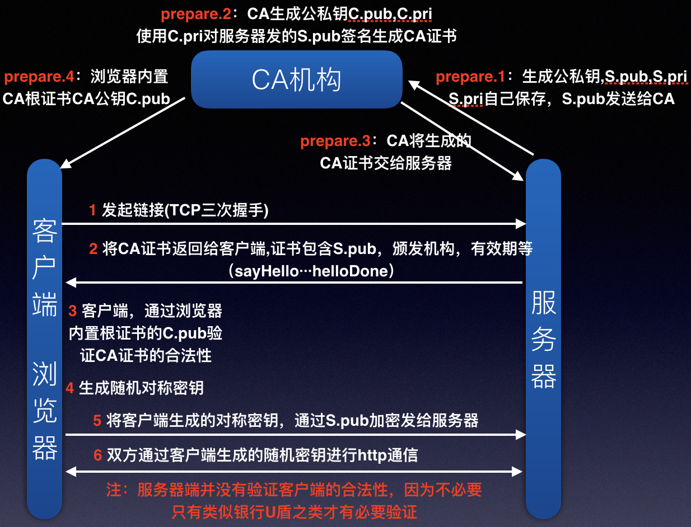

# https连接建立过程（主要分析其RTTs）
>http://www.cnblogs.com/mddblog/p/6948980.html#_label0

https使用的是443端口，而http使用的是80端口。TCP端口号是一个2字节的整型，处于TCP报文段的前四个字节（2字节源端口号，2字节目的端口号）。很明显范围是0~65535。其中0~1023具有特殊意义，已经被绑定，比如上面说的443，80，还有ftp的21端口。从1024~49151也具有特殊含义，但是还没有被用完，比如8080端口重定向。剩下的我们就可以随便使用，自定义了。其实之前在嵌入式开发中，没有连接外网，也没有使用浏览器等等这些。所以端口完全自定义随便用，不用担心冲突：）。

下面的过程为具体详细一点的过程：
## 1 客户端发起请求（对应图中1）

同样需要三次握手，建立TCP连接(毫无疑问HTTPS也是基于TCP的)

## 2 客户端发送Client Hello包（对应图中2）

**随机数**   
里面有1970年1月1日到现在的秒数，后面还有一个客户端发来的随机数Client.random

**Session ID**   
如果客户端与服务器费尽周折建立了一个HTTPS链接，刚建完就断了，也太可惜，所以用Session ID将其保存，如果下次再来可以直接使用之前的链接进行对话(对称密钥)。

**密文族**   
告诉服务器，自己支持的加密算法种类

**Server_name** 

## 3 Server Hello（对应图中2）

**随机数**  
对应服务器时间，服务器sever.random

**Seesion ID**   
如果客户端发给服务器的session ID在服务端有缓存，服务端会尝试使用这个session；否则服务器会启用新的并返回给客户端；

服务器挑选一个密文族

## 4 Certificate（对应图中2）

服务器终于发来我们想要的数字证书，包含了：签发机构、过期时间、主题名称、公共密钥信息、指纹信息等等

---
# TCP RTT测量方法
>http://lib.csdn.net/article/computernetworks/17032

---
# TCP CUBI拥塞控制算法
dsd 

---
# TCP 重传模糊问题
dsds