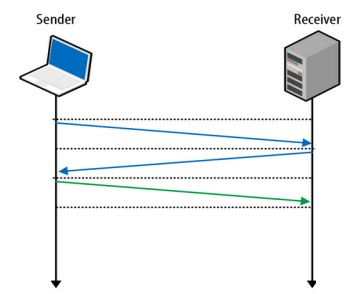
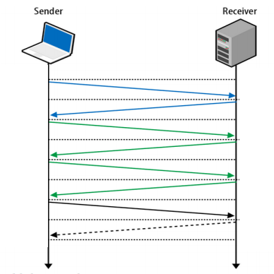
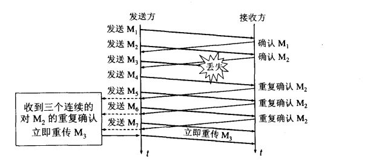
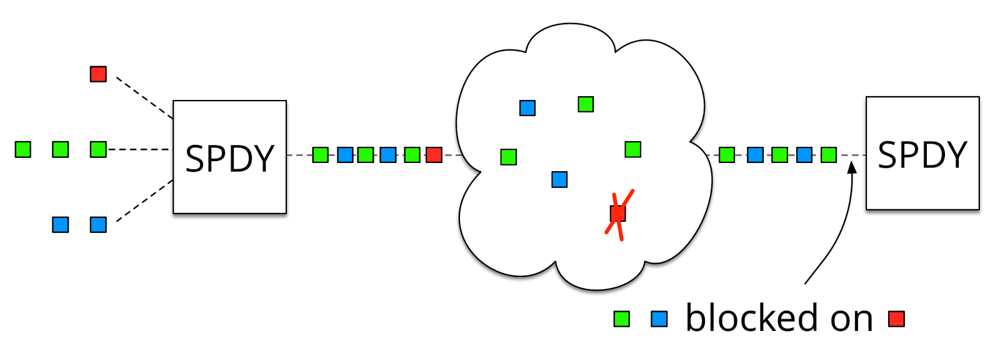
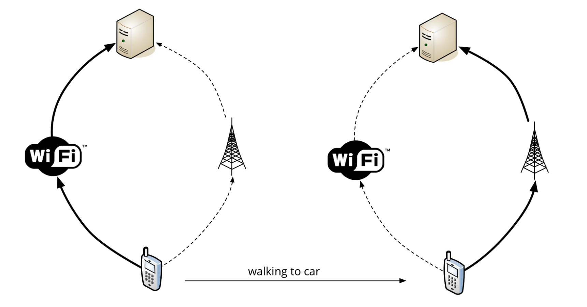

# <center>为什么会有quic？</center>
---
## 1、http、https的延时
http和https都是基于tcp，tcp在建立连接时三次握手会消耗3RTTs的时间，这意味着每次连接都会产生额外的往返(网络数据包在来回发送)，从而给每个连接增加了显著的延时。



https则需要TLS协商来创建一个安全、加密的https连接，那么就需要来回传送更多的网络数据包。https连接建立过程参考[这里](quic附带问题.md)



## 2、TCP的拥塞控制

### 2.1、慢开始
发送方维护一个拥塞窗口cwind的状态变量。拥塞窗口的大小取决于网络的拥塞程度，动态变化。通过逐渐增加cwind的大小来探测可用的网络容量，防止连接开始时采用不合适的发送量导致网络拥塞。 
- 当主机开始发送数据时，如果通过较大的发送窗口立即将全部数据字节都注入到网络中，由于不清楚网络情况，有可能引起网络拥塞； 
- 较好方法是试探，从小到达逐渐增大发送端拥塞控制窗口的cwind数值； 
- 开始发送报文段时，先将拥塞窗口cwind设置为一个最大报文段MSS值。每收到一个对新报文段的ACK确认后，将拥塞窗口cwind增加至多一个MSS的数值。当rwind足够大的时候，为防止拥塞窗口cwind的增长引起网络拥塞，还需要另外一个变量，慢开始门限ssthresh。

```
    当 cwind < ssthresh时，使用上述慢启动算法；          
    当 cwind > ssthresh时，停止使用慢启动算法，改用拥塞避免算法；
    当 cwind = ssthresh时，既可以使用慢开始算法，也可以使用拥塞避免算法。
```

慢启动局限性： 
- 需要获得网络内部流量分布的信息，浪费可用的网络容量，额外开销； 
- **估算合理的ssthresh值并不容易，可能耗时较长；**

慢启动的“慢”并不是指cwind的增长速度慢，而是指在TCP开始发送报文段时先设置cwind=1，使得发送方在开始时只发送一个报文段（目的是探测一下网络的拥塞情况），然后再逐渐增大cwind。

***Linux 内核里面设定了（常量TCP_INIT_CWND），刚开始通信的时候，发送方一次性发送10个数据包，即"发送窗口"的大小为10。然后停下来，等待接收方的确认，再继续发送。
默认情况下，接收方每收到两个 TCP 数据包，就要发送一个确认消息。"确认"的英语是 acknowledgement，所以这个确认消息就简称 ACK。***
### 2.2、拥塞避免
让拥塞窗口cwind缓慢地增大，每经过一个往返时间RTT就把发送方的拥塞窗口cwind加1，而不是加倍。这样拥塞窗口cwind线性缓慢增长，比慢开始算法的拥塞窗口增长速率缓慢得多。        
无论慢启动开始阶段还是在拥塞避免阶段，只要发送方判断网络出现拥塞（其根据就是没有收到确认），就要把慢启动门限ssthresh设置为出现拥塞时的发送方窗口值的一半（但不能小于2）。然后把拥塞窗口cwind重新设置为1。                 
*执行慢启动算法。目的是迅速减少主机发送到网络中的分组数，使得发生拥塞的路由器有足够时间把队列中积压的分组处理完毕。*


说明：         
- 由指数增长拉低到线性增长，降低出现拥塞的可能。“拥塞避免”并非指完全能够避免拥塞，利用以上的措施要完全避免网络拥塞还是不可能的。           
- 慢开始算法只是在TCP连接建立和网络出现超时时才使用。
- 关于拥塞控制的优缺点，参考[这里](http://blog.csdn.net/lucien_cc/article/details/7568050)和[这里](http://www.cnblogs.com/fll/archive/2008/07/12/1241630.html)

### 2.3、快重传
一条TCP连接有时会因等待重传计时器的超时而空闲较长的时间，慢开始和拥塞避免无法很好的解决这类问题，因此提出了快重传和快恢复的拥塞控制方法。 
快速重传算法首先要求接收方每收到一个**失序的报文段**后就立即发出重复确认（为的是使发送方及早知道报文段没有到达）。快重传算法并非取消了重传机制，只是在某些情况下更早的重传丢失的报文段，即：当TCP源端收到到三个相同的ACK确认时，即认为有数据包丢失，则源端重传丢失的数据包，而不必等待 RTO(Retransmission Timeout)超时。由于发送方尽早重传未被确认的报文段，因此，采用快重传后可以使整个网络吞吐量提高约20%。



### 2.4、快恢复
与快重传配合使用的还有快恢复算法，具体地： 
- 当发送方连续收到三个重复确认时，执行“乘法减小”算法，慢启动门限减半，为了预防网络发生拥塞。 
- 由于发送方现在认为网络很**可能没有发生拥塞**(如果网络发生了严重的拥塞，就不会一连有好几个报文段连续到达接收方)，因此现在不执行慢启动算法，而是把cwind值设置为慢启动门限减半后的值，然后开始执行拥塞避免算法，拥塞窗口cwind值线性增大。避免了当网络拥塞不够严重时采用”慢启动”算法而造成过大地减小发送窗口尺寸的现象。


说明：
- 新的 TCP Reno 版本在快重传之后采用快恢复算法而不是采用慢启动算法。从接收方对发送方的流量控制的角度考虑，发送方的发送窗口一定不能超过对方给出的接收窗口rwind 。

## 3、TCP的流量控制
- 早期的TCP协议只有基于窗口的流控制（flow control）机制，我们简单介绍一下，并分析其不足。在TCP中，为了实现可靠性，发送方发出一个数据段之后要等待接受方相应的确认信息，而不是直接发送下一个分组。
- **具体的技术是采用滑动窗口**，以便通信双方能够充分利用带宽。滑动窗口允许发送方在收到接收方的确认之前发送多个数据段。窗口大小决定了在收到目的地确认之前，一次可以传送的数据段的最大数目。窗口大小越大，主机一次可以传输的数据段就越多。当主机传输窗口大小数目的数据段后，就必须等收到确认，才可以再传下面的数据段。例如，若视窗的大小为 1，则传完数据段后，都必须经过确认，才可以再传下一个数据段；当窗口大小等于3时，发送方可以一次传输3个数据段，等待对方确认后，再传输下面三个数据段。  
- 窗口的大小在通信双方连接期间是可变的，通信双方可以通过协商动态地修改窗口大小。在TCP的每个确认中，除了指出希望收到的下一个数据段的序列号之外，还包括一个窗口通告，通告中指出了接收方还能再收多少数据段（我们可以把通告看成接收缓冲区大小）。如果通告值增大，窗口大小也相应增大；通告值减小，窗口大小也相应减小。但是我们可以发现，接收端并没有特别合适的方法来判断当前网络是否拥塞，因为它只是被动得接收，不像发送端，当发出一个数据段后，会等待对方得确认信息，如果超时，就可以认为网络已经拥塞了。
- **所以，改变窗口大小的唯一根据，就是接收端缓冲区的大小了**。   
- 流量控制作为接受方管理发送方发送数据的方式，用来防止接受方可用的数据缓存空间的溢出。

说明：
- 流控制是一种局部控制机制，其参与者仅仅是发送方和接收方，它只考虑了接收端的接收能力，而没有考虑到网络的传输能力；
- 而拥塞控制则注重于整体，其考虑的是整个网络的传输能力，是一种全局控制机制。正因为流控制的这种局限性，从而导致了拥塞崩溃现象的发生。 

## 4、http和SPDY的head-of-line阻塞
HTTP 协议的最大弊端就是每个 TCP 连接只能对应一个 HTTP 请求，即每个 HTTP 连接只请求一个资源，浏览器只能通过建立多个连接来解决。此外在 HTTP 中对请求是严格的先入先出（FIFO）进行的，如果中间某个请求处理时间较长会阻塞后面的请求。        
SPDY 规定在一个 SPDY 连接内可以有无限个并行请求，即允许多个并发 HTTP 请求共用一个 TCP会话。这样 SPDY 通过复用在单个 TCP 连接上的多次请求，而非为每个请求单独开放连接，这样只需建立一个 TCP 连接就可以传送网页上所有资源，不仅可以减少消息交互往返的时间还可以避免创建新连接造成的延迟，使得 TCP 的效率更高。              
但是单连接会因TCP线头阻塞（head-of-line blocking）的特性而传输速度受限。加上存在可能丢包的情况，其负面影响已超过压缩头部和优先级控制带来的好处。



## 5、移动设备稳定连接连接难以维持
在TCP中，需要4个参数组成一个连接。开始一个新的TCP连接，需要源IP、源端口、目的IP和目的端口。如果有任何参数发生了变化,就会需要一个新的TCP连接。在移动设备上保持一个稳定的连接非常困难，因为可能会不断切换WiFi和3G/LTE。

